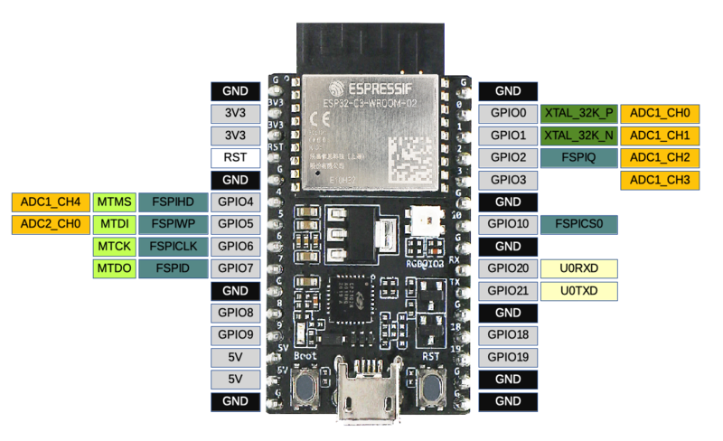

# Play Audio Files

## About

This micropython app demonstrates how to play audio files.

## Hardware

- [ESP32-C3-DevKitC-02](https://docs.espressif.com/projects/esp-idf/en/latest/esp32c3/hw-reference/esp32c3/user-guide-devkitc-02.html)
- [DFPlayer mini](https://wiki.dfrobot.com/DFPlayer_Mini_SKU_DFR0299)
- Speaker: I found an speaker from a radio clock with 16 Ohm and 0.5 W. It worked fine for me and was not too loud. Nice for development.

## Wiring

For the following, keep in mind that RX and TX should be crossed. RX on the ESP32 should be connected to TX on the DFPlayer mini and vice versa!
Wiring for RX/TX was difficult to me because I didn't knew, which pins on the ESP32-C3 could or should be used for RX and TX. I found out, that the pins RX (J3-9) and TX (J3-10) were not working for UART1.

First I tried the dfplayer package from Redoxcode. I did some testing and for me the following combinations worked for sending commands but not for reading data from the DFPlayer:

| TX on ESP32 | RX on ESP32 | UART  |
| ----------- | ----------- | ----- |
| 6 (J1-8)    | 9 (J1-12)   | UART1 |
| 10 (J3-7)   | 9 (J1-12)   | UART1 |

I observed, that GPIO 10 as TX works for many cases, even when I used another pin in my code as TX, e.g. `df=DFPlayer(uart,tx_pin_id==6,rx_pin_id=9)` which seems pretty strange to me. Additionally I observed some strange behaviour, which was independent of the wiring: other pins were working in my code, when one pin once was working. For example, when I used GPIO 7, 8, 9 as TX after wiring pin 6 and using pin 6 in my code theses pins worked. Very confusing, but perhaps the reason is, that the UART should have been deinitialized before using another pin. I didn't test this.

Here is the rest of the wiring:

| Cable color    | DFPlayer mini | ESP32-C3-DevKitC-02 | Speaker   |
| -------------- | ------------- | ------------------- | --------- |
| red            | VCC           | 3V3 (Pin J1-2)      |           |
| black          | GND           | GND (Pin J1-15)     |           |
| grey or white  | RX            | see table above     |           |
| purple or blue | TX            | see table above     |           |
| white          | SPK_1         |                     | Speaker + |
| black          | SPK_2         |                     | Speaker - |

Pin layout for [DFPlayer mini](https://wiki.dfrobot.com/DFPlayer_Mini_SKU_DFR0299):


Pin layout for [ESP32-C3-DevKitC-02](https://docs.espressif.com/projects/esp-idf/en/latest/esp32c3/hw-reference/esp32c3/user-guide-devkitc-02.html):



## Getting started

For required software and installation, see [Micropython Setup](../../doc/setup-micropython.md)

Additionally, you will need some kind of library to access the player. The DFPlayer Mini libraries from [Redoxcode](https://pypi.org/project/micropython-dfplayer) and [lavron](https://github.com/lavron/micropython-dfplayermini) helped me a lot, see next section.

## Programming the DFPlayer mini

In general, programming the DFPlayer Mini isn't very difficult. You can send commands to the DFPlayer Mini via UART. The commands are described in the [DFPlayer Mini datasheet](https://wiki.dfrobot.com/DFPlayer_Mini_SKU_DFR0299) but the description is rather short and not very detailed. I found that some queries and commands did not work as I expected (e. g. querying the version). I found some more documentation in the GitHub repository of [DFRobot](https://github.com/DFRobot/DFRobotDFPlayerMini). It's a bit more detailed but not consistent with the DFRobot wiki.

### SD card, folders and file names

You will need a micro SD card with a FAT16 or FAT32 file system. There is VERY different information about the naming conventions for the audio files and folders. I tried a lot until I discovered that my SD card was not working properly :-(.  
After exchanging the SD card with a working one the following structure worked for me:

```PS
/root
    /01
        001.mp3
        002.mp3
        003.mp3
    /02
        001.mp3
        002.mp3
        003.mp3
    /03
        001.mp3
        002.mp3
        003.mp3
```

or, with full file names:

```PS
/01/001.mp3
/01/002.mp3
/01/003.mp3
/02/001.mp3
/02/002.mp3
/02/003.mp3
/03/001.mp3
/03/002.mp3
/03/003.mp3
```

## Building

Nothing to build

## Flashing and Running

This source code has two examples, one which is using the `dfplayer` package from Redoxcode and one which is using a module which I wrote on my own with help from [Redoxcode](https://pypi.org/project/micropython-dfplayer) and [lavron](https://github.com/lavron/micropython-dfplayermini)

### First solution: Redoxcode

For this solution I used the `dfplayer` package from Redoxcode as I found it in the internet. I added it to this repo to reproduce this solution easily.

You will need the folder `/dfplayer` and the file `redox-demo.py`.

Copy package to controller with

```PS
ampy -p COM11 put .\src\dfplayer
```

Run the app with

```PS
ampy -p COM11 -b 115200 run .\src\redox-demo.py
```

### Second solution: Own module

For this solution I wrote my own module `dfplayerminilib.py`. I did this because I didn't succeed to query data with the Redoxcode package. I assume that the pause of 0.05 seconds after sending a command in this package is too short. I didn't test this.

You will need the files `dfplayerminilib.py` and the file `dfplayerminilib-demo.py`.

Copy files and folders to controller with

```PS
ampy -p COM11 put .\src\dfplayerminilib.py
```

Run the app with

```PS
ampy -p COM11 -b 115200 run .\src\dfplayerminilib-demo.py
```

This script will print the following output:

```PS
Player init
Volume: 15
Playing
Player paused
Volume: 25
Player resumed
Player stopped
```

## Helpful links

- [Extended explanation for DFPlayer mini (German)](https://www.elektronik-kompendium.de/sites/praxis/bauteil_dfplayer-mini.htm)
- [Description of UART class](https://docs.micropython.org/en/latest/library/machine.UART.html)
